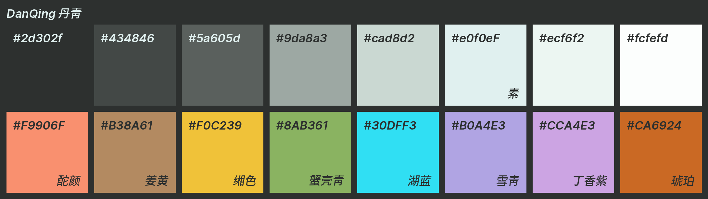

# DanQing scheme for base16

A colorscheme based on traditional Chinese colors. The word DanQing (丹青) is a
pronoun for Chinese painting which colors inspire this colorscheme.

Color palette -- generated by [base16-color-palette-creator](https://github.com/CosmosAtlas/base16-color-palette-creator)

Example in vim -- source in Ruby

